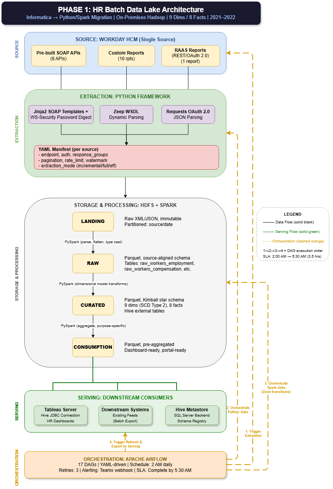
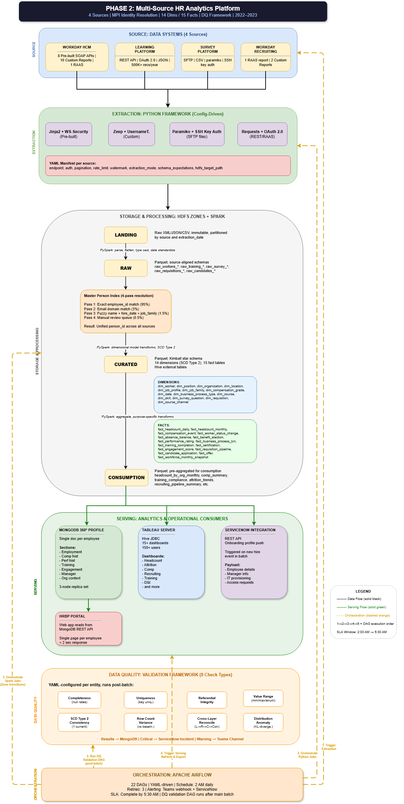
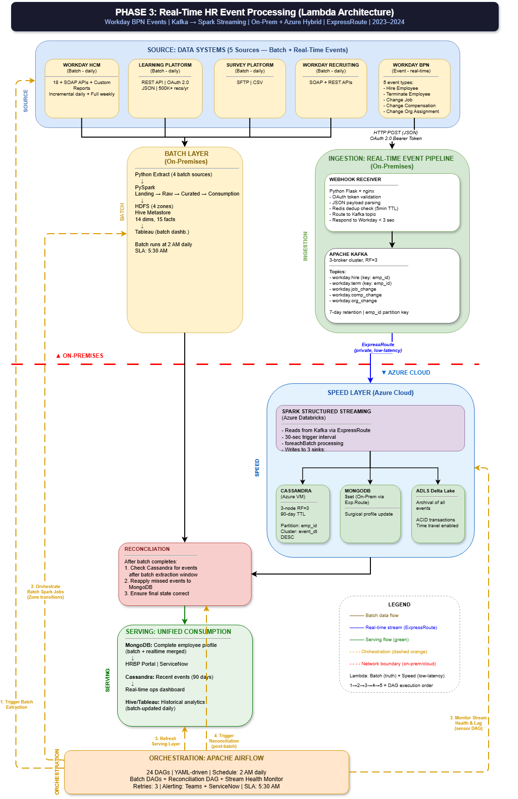
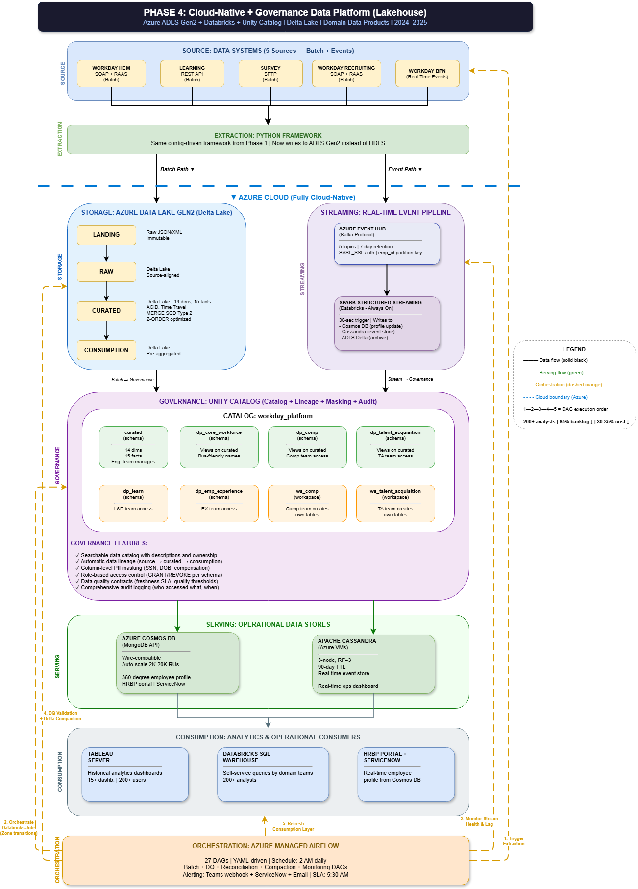
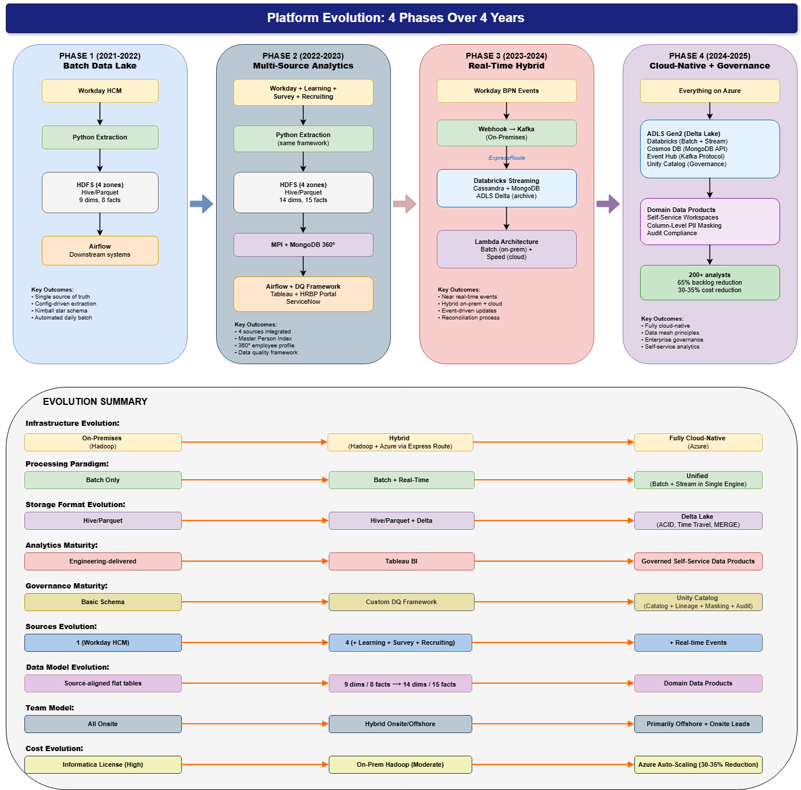
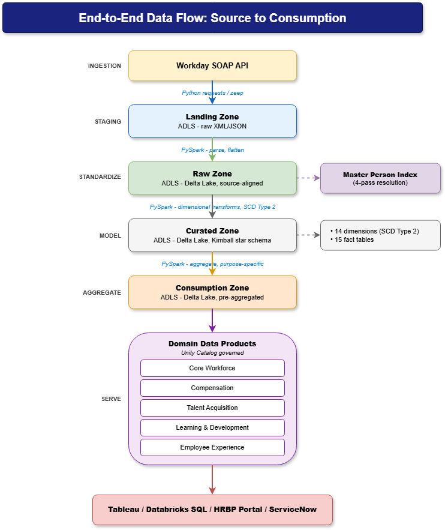

# Enterprise Data Platform Evolution: 4 Phases Over 4 Years
**From On-Premises Batch to Cloud-Native Real-Time with Governance**

## About This Project
This is a personal architecture design exercise created in 2025. It represents how I would modernize an enterprise HR data platform through four evolutionary phases — from on-premises batch processing to real-time hybrid architecture and finally to a cloud-native Azure Lakehouse.

The phase dates (2021–2025) represent a hypothetical migration timeline, illustrating how each phase builds on the previous one over a realistic four-year modernization journey. This repository is a design artifact demonstrating architectural thinking, modernization strategy, and platform evolution patterns — not documentation of a running production system.

## Context 
This design is inspired by my architecture and production experience with large-scale HR data platforms involving SQL Server, Azure Databricks, Workday integrations, enterprise data integration, reconciliation controls, data quality frameworks, downstream consumers, and analytics enablement.

In my current role, I contribute to architecture, integration design, performance optimization, and production reliability for a large-scale HR data platform serving 105K+ employees at a global Big 4 firm, with strong reconciliation controls and no sustained data gaps across 6+ years.

This design explores the question:
> What if I could rebuild an enterprise HR data platform from scratch using modern data stack technologies, with a phased migration approach?

## Architecture Phases

| Phase | Period | Focus | Key Technologies |
| :--- | :--- | :--- | :--- |
| **Phase 1** | Year 1 | Batch Data Lake | Python, PySpark, HDFS, Hive/Parquet, Airflow, Kimball (9 dims, 8 facts) |
| **Phase 2** | Year 2 | Multi-Source Analytics | + Kafka, MongoDB 360°, MPI (4-pass identity resolution), DQ Framework (8 types), 14 dims, 15 facts |
| **Phase 3** | Year 3 | Real-Time Hybrid (Lambda) | + Kafka (3-broker, 5 topics), Spark Structured Streaming, Cassandra, ExpressRoute, Webhook/Flask, Reconciliation |
| **Phase 4** | Year 4 | Cloud-Native + Governance | Azure (ADLS Gen2, Databricks, Event Hub, Cosmos DB), Delta Lake (MERGE SCD2, Z-ORDER), Unity Catalog, Domain Data Products, Managed Airflow |

## Phase 1: Batch Data Lake Architecture

**Key Design Decisions:**
* YAML-driven extraction framework (configuration over code for source onboarding)
* 4-zone data lake (Landing → Raw → Curated → Consumption)
* Kimball star schema on Parquet/Hive (9 dims SCD2, 8 facts)
* Apache Airflow orchestration (17 DAGs, YAML-driven, SLA 5:30 AM)

## Phase 2: Multi-Source HR Analytics Platform

**Key Design Decisions:**
* Master Person Index with 4-pass identity resolution (exact 95% → email 3% → fuzzy 1.5% → manual 0.5%)
* Expanded to 4 sources (Workday + Learning + Survey + Recruiting)
* MongoDB 360° employee profile (single doc per employee, 3-node replica set, <2 sec response)
* Data Quality framework (8 check types with severity routing)
* 14 dimensions, 15 facts with Hive external tables
* ServiceNow integration for onboarding automation

## Phase 3: Real-Time HR Event Processing (Lambda Architecture)

**Key Design Decisions:**
* Lambda Architecture: Batch (truth/complete) + Speed (low-latency) with explicit reconciliation
* Kafka (3-broker cluster, RF=3, 5 topics, emp_id partition key for ordering guarantee)
* Webhook receiver (Python Flask + nginx, Redis dedup 5-min TTL, OAuth2 validation, <3 sec response)
* Spark Structured Streaming (30-sec trigger, foreachBatch, 3 sinks)
* Cassandra (partition: emp_id, cluster: event_dt DESC, 90-day TTL, RF=3)
* ExpressRoute for private on-prem ↔ Azure connectivity
* Reconciliation: After batch completes → check Cassandra → reapply missed events → ensure final state

**Why Lambda over Kappa:** HR data requires authoritative daily snapshot. Batch processes ALL data with full validation = truth layer. Streaming adds speed for operational use cases but shouldn't be sole source.

**Why emp_id as Kafka partition key:** All events for one employee (hire → job_change → comp_change) must be processed IN ORDER. Same partition = ordering guarantee.

## Phase 4: Cloud-Native + Governance Data Platform (Lakehouse)

**Key Design Decisions:**
* Everything on Azure (ADLS Gen2 + Databricks + Event Hub + Cosmos DB)
* Delta Lake with MERGE SCD Type 2, Z-ORDER optimized, ACID transactions, Time Travel
* Unity Catalog governance with domain schemas (dp_core_workforce, dp_comp, dp_talent_acquisition, dp_learn, dp_emp_experience)
* Domain workspaces for self-service (teams create own tables within governed boundaries)
* Cosmos DB (MongoDB API, auto-scale 2K-20K RUs) replacing self-managed MongoDB
* Azure Managed Airflow (27 DAGs)
* Data Mesh principles: domain ownership + centralized governance via Unity Catalog

**Governance Features:**
* Searchable data catalog with descriptions and ownership
* Automatic data lineage (source → curated → consumption)
* Column-level PII masking (SSN, DOB, compensation)
* Role-based access control (GRANT/REVOKE per schema)
* Data quality contracts (freshness SLA, quality thresholds)
* Comprehensive audit logging

## Evolution Summary

| Dimension | Phase 1 | Phase 2 | Phase 3 | Phase 4 |
| :--- | :--- | :--- | :--- | :--- |
| **Infrastructure** | On-Prem Hadoop | On-Prem Hadoop | Hybrid (ExpressRoute) | Fully Cloud-Native (Azure) |
| **Processing** | Batch Only | Batch Only | Batch + Real-Time | Unified (Single Engine) |
| **Storage** | Hive/Parquet | Hive/Parquet | Hive + Delta | Delta Lake (ACID, Time Travel) |
| **Analytics** | Engineering-delivered | Tableau BI | Tableau + Ops dashboard | Governed Self-Service |
| **Governance** | Basic Schema | Custom DQ Framework | + Reconciliation | Unity Catalog (Lineage, Masking, Audit) |
| **Sources** | 1 (Workday) | 4 (+Learning, Survey, Recruiting) | 5 (+ Real-time Events) | 5 + Real-time Events |
| **Data Model** | 9 dims, 8 facts | 14 dims, 15 facts | 14 dims, 15 facts | Domain Data Products |
| **Team Model** | All Onsite | Hybrid Onsite/Offshore | Hybrid | Primarily Offshore + Onsite Leads |
| **Cost** | Informatica (High) | On-Prem Hadoop (Moderate) | Hybrid (Model-High) | Azure Auto-Scaling (30-35% Reduction) |

## End-to-End Data Flow: Source to Consumption

 
This diagram shows the complete data journey through the platform:
* **Ingestion:** Workday SOAP API via Python (requests/zeep)
* **Staging (Landing Zone):** Raw XML/JSON preserved in ADLS
* **Standardize (Raw Zone):** PySpark parse/flatten → Delta Lake, source-aligned + Master Person Index (4-pass resolution)
* **Model (Curated Zone):** PySpark dimensional transforms → Kimball star schema (14 dims SCD Type 2, 15 facts)
* **Aggregate (Consumption Zone):** Pre-aggregated Delta Lake tables for performance
* **Serve (Domain Data Products):** Unity Catalog governed domains (Core Workforce, Compensation, Talent Acquisition, Learning & Development, Employee Experience)
* **Consume:** Tableau / Databricks SQL / HRBP Portal / ServiceNow

## Key Architectural Decisions
1.	YAML-driven extraction — configuration over code for source onboarding
2.	4-zone data lake (Landing → Raw → Curated → Consumption) — separation of concerns
3.	Master Person Index with 4-pass resolution — identity resolution across heterogeneous sources
4.	Lambda Architecture with explicit reconciliation — batch truth + speed low-latency + guaranteed consistency
5.	Kafka with emp_id partition key — ordering guarantee for employee event sequences
6.	Redis dedup in webhook receiver — prevents duplicate event processing at ingestion point
7.	Delta Lake replacing Hive/Parquet — ACID transactions, time travel, MERGE for SCD Type 2
8.	Unity Catalog domain schemas — data mesh-inspired governed self-service without data duplication
9.	Managed Airflow with progressive DAG growth (17→22→24→27) — orchestration scales with platform
10.	Cosmos DB replacing self-managed MongoDB — auto-scaling, wire-compatible, zero operational overhead

## How This Relates to My Production Experience
In my current role, I contribute to architecture, integration design, performance optimization, and production reliability for a large-scale HR data platform across SQL Server and Azure Databricks, serving 105,000+ employees at a global Big 4 firm with strong reconciliation controls and no sustained data gaps across 6+ years.

The production lessons that informed this design:
* Zero-gap guarantee → inspired the reconciliation process in Phase 3
* Configuration-driven onboarding → inspired the YAML manifest extraction framework
* 3-step CDC → evolved into MERGE SCD Type 2 on Delta Lake in Phase 4
* Multi-source integration (8 systems) → inspired the Master Person Index design
* 3-tier security model → evolved into Unity Catalog RBAC domain schemas
* Pre-aggregation strategy → carried forward into consumption zone design
* Incident RCA methodology → informed the reconciliation and DQ framework design

## Technologies Covered
Python, PySpark, Apache Spark, Spark Structured Streaming, Apache Kafka, Apache Airflow, HDFS, Hive, Parquet, Delta Lake, MongoDB, Cassandra, Redis, Flask, nginx, Azure Databricks, Azure Data Lake Storage Gen2, Azure Event Hub, Azure Cosmos DB, Unity Catalog, Tableau, Docker, ExpressRoute

## Status
Architecture design complete. This represents platform modernization strategy and architectural thinking, not a running production implementation.

## Confidentiality Note
This repository contains only sanitized, generic architecture designs created for portfolio purposes. It does not include proprietary client documentation, confidential data, production code, internal system names, credentials, or real employee/customer data.

## Author
**Sri Adilakshmi Marrivada**  
Lead Consultant | Data Platform Architect | 19+ Years Experience  
[LinkedIn Profile](https://www.linkedin.com/in/sri-adilakshmi-marrivada)
